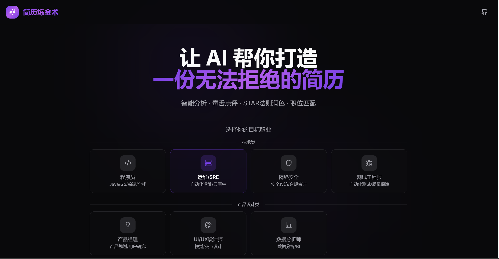

# 简历炼金术 Resume Alchemy

### 📖 项目简介

**简历炼金术** 是一款基于 AI 的智能简历优化工具，帮助求职者打造更具竞争力的简历。通过 AI 分析、毒舌点评、STAR 法则润色和职位匹配等功能，让你的简历脱颖而出。





#阿里云ESA Pages #阿里云云工开物

本项目是**阿里云 ESA (Edge Security Acceleration) 边缘计算创新大赛**的创意参赛作品。

借助 **阿里云 ESA** 强大的边缘计算能力，我们将这个富交互的静态网站分发到全球节点，确保用户在世界任何角落都能体验到闪电般的加载速度。


### ✨ 核心功能

| 功能 | 描述 |
|------|------|
| 🔍 **智能诊断** | 综合评分 + 六维雷达图，全面分析简历质量 |
| 🎯 **毒舌点评** | 犀利幽默的 HR 视角点评，直击痛点 |
| ✍️ **AI 润色** | 基于 STAR 法则的专业润色，支持流式输出实时显示 |
| 🎯 **职位匹配** | JD 关键词对比，精准优化建议 |
| ⚡ **单句润色** | 快速优化单个句子，支持标准/数据/专家三种模式，流式响应 |
| 📄 **简历导出** | 支持多种模板，一键导出 PDF |
| 📁 **文件导入** | 支持导入 Markdown/TXT 文件，拖拽上传 |

### 🏭 支持行业

**技术类**
- 💻 技术/程序员
- 🖥️ 运维/SRE
- 🛡️ 网络安全
- 🐛 测试工程师

**产品与设计**
- 📦 产品经理
- 🎨 UI/UX 设计师

**业务与职能**
- 📊 数据分析师
- 📢 市场/运营
- 💼 销售
- 👥 人力资源
- 🧮 会计/财务

### 🛠️ 技术栈

- **前端**: React 18 + TypeScript + Vite
- **样式**: Tailwind CSS + shadcn/ui
- **动画**: Framer Motion
- **后端**: Supabase Edge Functions
- **AI**: 硅基流动 API (SiliconFlow)
- **数据库**: Supabase PostgreSQL

### 🚀 快速开始

```bash
# 克隆项目
git clone <your-repo-url>
cd resume-alchemy

# 安装依赖
npm install

# 启动开发服务器
npm run dev
```

### 📁 项目结构

```
├── src/
│   ├── components/          # React 组件
│   │   ├── ui/              # shadcn/ui 基础组件
│   │   ├── resume-templates/ # 简历模板
│   │   ├── AnalysisResult.tsx
│   │   ├── PolishEditor.tsx
│   │   ├── JDMatcher.tsx
│   │   └── ...
│   ├── hooks/               # 自定义 Hooks
│   │   └── useResumeAI.ts   # AI 功能 Hook
│   ├── lib/                 # 工具函数
│   ├── pages/               # 页面组件
│   └── integrations/        # 第三方集成
├── supabase/
│   ├── functions/           # Edge Functions
│   │   └── resume-ai/       # AI 处理函数
│   └── config.toml          # Supabase 配置
├── docs/
│   └── DEPLOYMENT.md        # 自部署教程
└── public/                  # 静态资源
```

### 🔐 环境变量

项目使用 Supabase Secrets 管理敏感配置：

| 变量名 | 说明 |
|--------|------|
| `SILICONFLOW_API_KEY` | 硅基流动 API 密钥 |
| `SILICONFLOW_MODEL` | AI 模型名称 (如 `Qwen/Qwen3-8B`) |

### 📝 使用说明

1. **选择行业** - 首页选择你的目标职业
2. **上传简历** - 粘贴简历内容
3. **查看分析** - AI 会给出评分、点评和改进建议
4. **润色简历** - 使用 AI 润色功能优化内容
5. **职位匹配** - 输入 JD 进行匹配度分析
6. **导出简历** - 选择模板导出 PDF

### 🔒 安全特性

- ✅ API 密钥存储在服务器端，前端不可见
- ✅ 基于 IP 的速率限制（每分钟 10 次）
- ✅ 模型名称服务器端配置，防止滥用

---

## 声明
“本项目由阿里云ESA提供加速、计算和保护”


